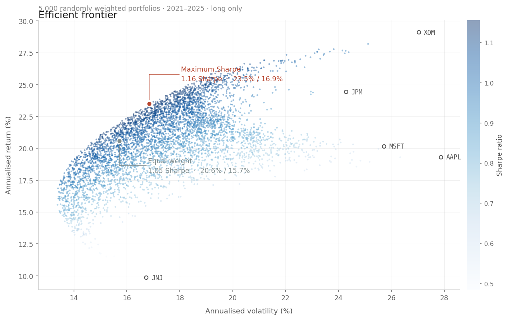
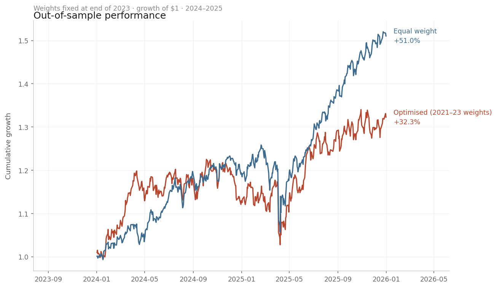
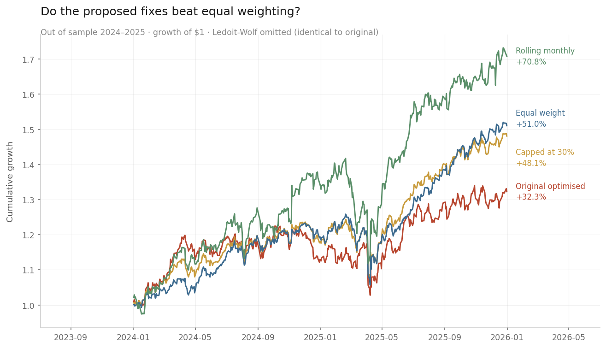

# Portfolio Risk & Optimization Engine

Mean-variance portfolio optimization applied to a five-stock equity portfolio, with an out-of-sample test against a naive equal-weight benchmark.

**Headline result: the optimizer lost to equal weighting out of sample** — lower return, higher volatility, no reduction in drawdown.

## Data

Five US large caps from distinct sectors, daily closes 2021–2025 via `yfinance`:

`AAPL` · `MSFT` (technology) · `JPM` (financials) · `XOM` (energy) · `JNJ` (healthcare)

## Method

1. Convert prices to daily returns; annualise mean return (×252) and volatility (×√252).
2. Build the correlation and covariance matrices to measure co-movement.
3. Compute portfolio volatility as √(wᵀΣw) for a given weight vector.
4. Maximise the Sharpe ratio via SLSQP (`scipy.optimize.minimize`), long-only, weights summing to 1.
5. Plot the efficient frontier over 5,000 randomly weighted portfolios.
6. **Out-of-sample test:** fit weights on 2021–2023 only, hold them fixed, evaluate on 2024–2025.

## Results

### In-sample (2021–2025)

Equal weighting produced 20.6% annualised return at 15.7% volatility — below the volatility of *every individual holding*, including the least volatile (JNJ, 16.7%). Optimization raised the Sharpe ratio from 1.06 to 1.16.

The diversification comes from low cross-sector correlation: MSFT–JNJ and MSFT–XOM both sit at 0.08, against 0.63 for AAPL–MSFT. No pair is negatively correlated, so diversification reduces risk here without eliminating it.

### Out-of-sample (2024–2025)

Weights fitted on 2021–2023: **XOM 63.2%, MSFT 36.8%**, zero in the remaining three.

| | Return | Volatility | Sharpe | Max drawdown |
|---|---|---|---|---|
| Optimized | 15.4% | 16.2% | 0.70 | −16.1% |
| Equal weight | **21.7%** | **13.9%** | **1.27** | −16.0% |

Cumulative: **+32.3%** optimized vs **+51.0%** equal weight.

The optimizer underperformed on both axes — less return *and* more risk — while delivering no drawdown protection.

## Why the optimizer failed

- **Concentration.** Fitting on a window in which energy outperformed, the optimizer allocated 63% to a single name and excluded three holdings entirely, collapsing a five-sector portfolio into a two-name bet.
- **Loss of diversification.** The 15.7% in-sample portfolio volatility was a product of low cross-sector correlations. Concentrating into MSFT and XOM discarded that, which is why the "optimized" portfolio was *more* volatile out of sample.
- **Estimation error.** 752 observations is thin for estimating expected returns, and mean-variance weights are highly sensitive to those estimates. The optimizer treats noisy sample means as known parameters.
- **Regime change.** The energy outperformance that drove the allocation did not persist. The optimizer extrapolates the estimation window and has no mechanism to anticipate this.

This reproduces a documented finding: DeMiguel, Garlappi & Uppal (2009), *Optimal Versus Naive Diversification: How Inefficient is the 1/N Portfolio Strategy?*, **Review of Financial Studies** 22(5), which found naive 1/N allocation outperformed sample-based mean-variance optimization across fourteen datasets.

## Limitations

- Single test window; the two lines are near-indistinguishable through 2024 and diverge only late, so the conclusion is sensitive to the test period chosen.
- Five assets, US large-cap equities only.
- No transaction costs or rebalancing — weights are set once and held.
- Fixed 4% risk-free rate.

## Possible extensions

## Testing the proposed extensions

The three fixes suggested above were implemented and tested on the same out-of-sample split: weights fitted on 2021–2023, evaluated on 2024–2025.

| | Return | Volatility | Sharpe | Max drawdown |
|---|---|---|---|---|
| Original optimised | 15.36% | 16.24% | 0.70 | −16.11% |
| Ledoit-Wolf shrinkage | 15.36% | 16.24% | 0.70 | −16.11% |
| Capped at 30% | 20.68% | 13.87% | 1.20 | **−13.83%** |
| Equal weight | 21.68% | 13.93% | **1.27** | −16.01% |
| Rolling monthly | **28.79%** | 19.55% | 1.27 | −21.15% |

**None of the three fixes beat equal weighting on a risk-adjusted basis.**

**Ledoit-Wolf shrinkage changed nothing.** The estimated shrinkage intensity was 0.021 — a 2% adjustment — and the resulting weights and performance were identical to the original to four significant figures. With five assets and 752 observations the sample covariance matrix is already adequately conditioned; shrinkage addresses covariance estimation error, while the instability here originates in the expected-return estimates, which the method does not touch.

**Weight caps recovered most of the lost performance.** Constraining each holding to 30% raised the Sharpe from 0.70 to 1.20 and produced the lowest drawdown of any allocation tested at −13.83%. This confirms concentration as the failure mechanism rather than the optimisation procedure itself. It still fell short of equal weighting, which is unsurprising: a weight cap is a partial move toward 1/N, and the complete version performed better.

**Rolling re-optimisation produced the highest return and no risk-adjusted improvement.** Monthly re-fitting on a trailing two-year window returned 28.79%, but at 19.55% volatility and a −21.15% drawdown, for a Sharpe of 1.27 — identical to equal weighting. The additional return was compensation for additional risk, not evidence of skill. Turnover is also substantial: the optimiser allocated 93% to XOM in January 2024 and 0% by December, with JNJ moving from nothing to 35% over the following year. Transaction costs are not modelled, so the realised figure would be lower.

The pattern across all three is consistent: the modifications that improved results are those that pushed the portfolio closer to equal weighting. None surpassed it. This strengthens rather than qualifies the original finding and is consistent with DeMiguel, Garlappi & Uppal (2009).

## Remaining extensions

Risk-parity and minimum-variance allocation, neither of which requires estimating expected returns; multiple non-overlapping test windows; explicit turnover costs applied to the rolling strategy; a larger asset universe, where shrinkage would be expected to matter more.

Shrinkage estimation of the covariance matrix (Ledoit–Wolf), weight caps to force diversification, rolling-window re-optimization, and risk-parity or minimum-variance allocation as alternative objectives.

## Running it

Open `portfolio_risk.ipynb` in Google Colab and run the cells in order. Requires `yfinance`, `pandas`, `numpy`, `scipy`, `matplotlib`.
